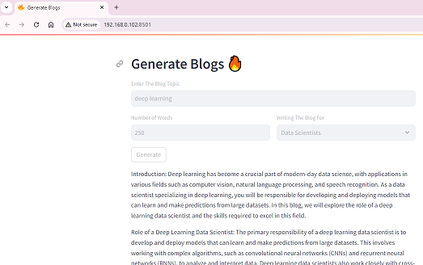
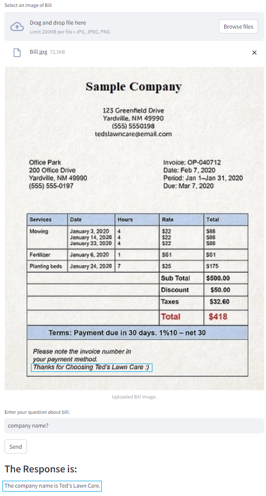

# Handson Generative AI 
This repository contains some small projects related GenerativeAI with different libraries.

## Blog By LLAMA 
This project implemented by LLAMA2. LLAMA has different models with different number of parameters and most of them have huge size. There are some Quantized model exist that can be download from hugingface site. Here I used local system for implementing this project then "llama-2-7b-chat.ggmlv3.q4_0.bin" with around 3.7GB is used.

Following figure represent the output of this project.

## Bill Extrctor
This project used Gemini pro vision, to intrepret upload image and extract different part of it, then when the user ask any question, the model try to find related part of the image and asnwer to the question. 

Following figure represent a sample uploaded bill and the answer of Gemini pro vision the the user question:

