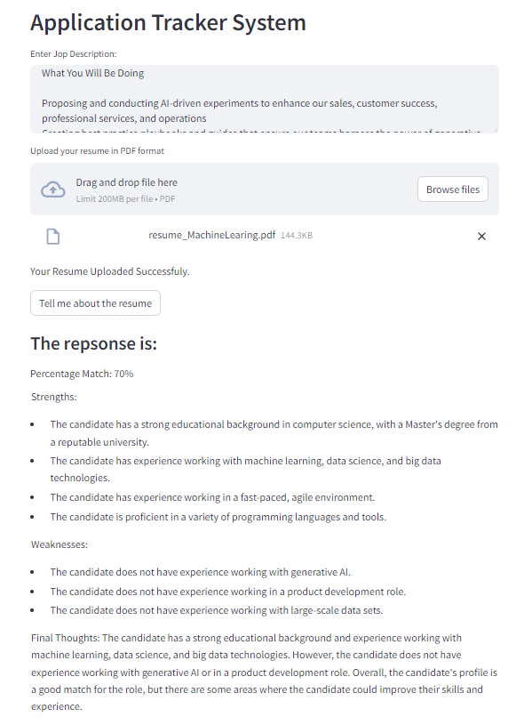

## Handson Generative AI 
This repository contains some small projects related GenerativeAI with different libraries.
For all of these projects:
- Create an environmnet with Python 3.10
- install requirements
- run the app.py file with streamlit 
- for Gemini project the API KEY should save in a .env file or set as environment variable
- if use windows, for converting pdf to image a the poppler_path should added to .env file or set as one of the default system path  

### Blog By LLAMA 
This project implemented by LLAMA2. LLAMA has different models with different number of parameters and most of them have huge size. There are some Quantized model exist that can be download from hugingface site. Here I used local system for implementing this project then "llama-2-7b-chat.ggmlv3.q4_0.bin" with around 3.7GB is used.

Following figure represent the output of this project.

### Bill Extrctor
This project used Gemini pro vision, to intrepret upload image and extract different part of it, then when the user ask any question, the model try to find related part of the image and asnwer to the question. 
Following figure represent a sample uploaded bill and the answer of Gemini pro vision the the user question:

### Application Tracking 
This is a project that helps HR to track the reciving resume and check whether it is match with the specific job profile or not. what is the stranghes and weaknesses of the applicant. For this reason the Gemini pro vision model is used. the system get the resume in pdf format and convert it to image. This image will sent to Gemini model to analysis and return the requested information. 

In following figure a sample of running this application illustrate:
